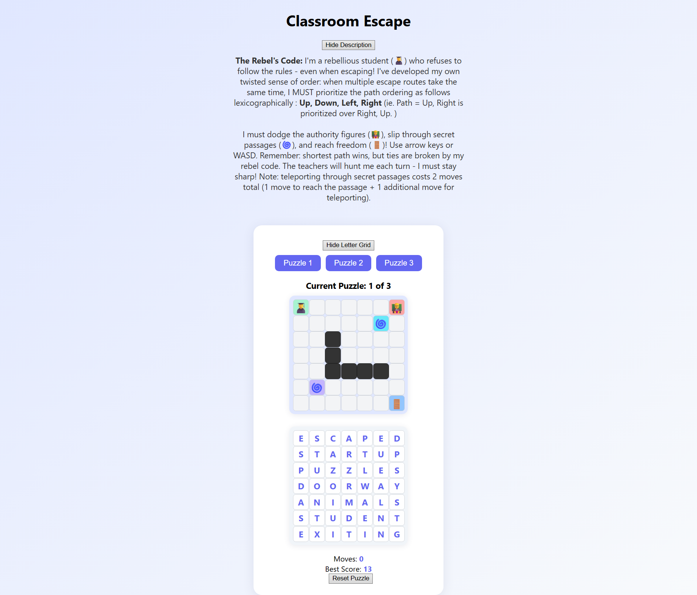

# The Rebel

## Problem
This puzzle is an interactive grid-based escape challenge.

We are given:
- A grid with obstacles, guards, and teleport points  
- Movement rules with strict priority ordering  
- A letter grid used for extraction  

The goal is to find the correct path and extract a final answer.

---

## Puzzle Interface

---

## Approach

### 1. Understand Movement Rules
Movement follows a strict priority order:
Up → Down → Left → Right  

When multiple shortest paths exist, this order determines which path is valid.

Additional constraints:
- Must avoid authority figures (moving obstacles)  
- Teleporters cost extra moves  
- Shortest path must be followed exactly  

---

### 2. Find the Optimal Path
For each puzzle:
- Compute the shortest valid path from start to goal  
- Respect tie-breaking rules strictly  
- The result is a unique path  

Solving each grid reveals hidden numbers.

---

### 3. Trace Letters Along the Path
Each path overlays onto a letter grid.

- Record letters along the path  
- This forms a sequence of characters  

---

### 4. Use Extracted Indices
Each puzzle provides numbers.

- Use these numbers as indices into the letter sequence  
- Extract corresponding letters  

Example:
- Indices produce: O, P, P  

---

### 5. Combine Results
Repeat for all three grids.

Combining all extracted letters forms:
OPPOSITION

---

## Solution
OPPOSITION

---

## Notes
- The key constraint is tie-breaking in shortest path selection  
- Small deviations produce incorrect letter sequences  
- The puzzle combines pathfinding with indexed extraction  