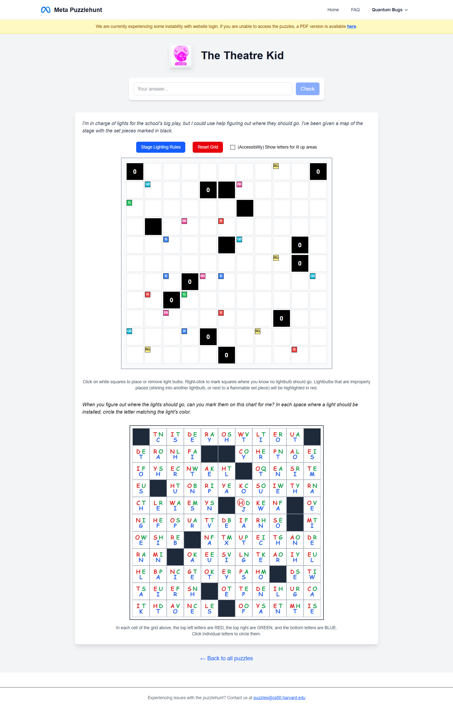

# The Theatre Kid

## Problem
This puzzle is an interactive grid-based logic challenge involving stage lighting.

We are given:
- A grid with obstacles and numbered cells (e.g., 0)
- Colored light sources (Red, Green, Blue)
- Rules governing light placement
- A letter grid used for final extraction

The goal is to correctly place lights and extract a final answer.

---

## Puzzle Interface

---

## Approach

### 1. Understand Placement Rules
Lights must follow strict constraints:

- Lights cannot be placed adjacent to cells marked "0"  
- Lights cannot shine into each other (same row or column)  
- Specific cells must be illuminated with exact color combinations  

These rules define a constraint-based logic puzzle.

---

### 2. Place Lights Using Deduction
Start with constrained positions:

- Identify cells with strict color requirements  
- Test possible placements  
- Eliminate invalid configurations using contradictions  

Example reasoning:
- If a blue light conflicts with a required red-green cell, it is invalid  
- If a placement violates adjacency or line-of-sight rules, discard it  

Each valid placement reduces possibilities for others.

---

### 3. Complete the Grid
Continue iteratively:
- Place lights  
- Propagate constraints  
- Resolve remaining ambiguity  

Eventually, the grid reaches a unique valid configuration.

---

### 4. Extract Letters
Use the completed grid with the letter board:

- Each cell contains letters mapped to colors:
  - Red (top-left)  
  - Green (top-right)  
  - Blue (bottom)  

For each light:
- Select the letter corresponding to its color  

---

### 5. Form the Final Phrase
Reading the selected letters reveals:

ET TU BRUTE

This is a reference to Shakespeare’s *Julius Caesar*.

---

## Solution
CAESAR

---

## Notes
- The puzzle combines constraint satisfaction with logical deduction  
- Early correct placements significantly reduce complexity  
- The final extraction depends on correctly mapping colors to letters  